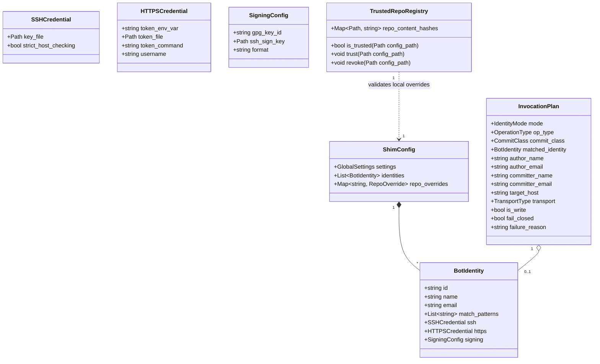
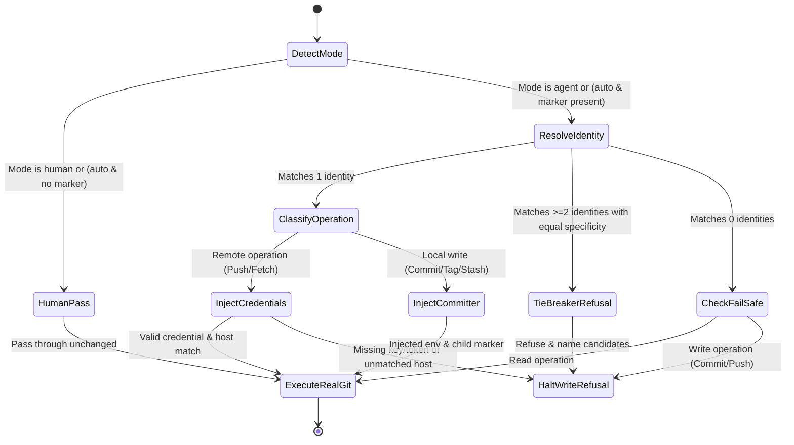

# Data Model: Git Author Identity Shim

**Feature**: [spec.md](./spec.md) · **Plan**: [plan.md](./plan.md) · **Status**: Completed

## 1. Core Entities and Relationships

---

## 2. Entity Definitions & Field Specifications

### 2.1 `BotIdentity`
Represents an automated committer and its host-scoped credentials.
* **`id`** (`string`, required): Unique identifier for the bot profile (e.g. `"work-github"`, `"personal-gitlab"`).
* **`name`** (`string`, required): Display name used for Git commits and tags (e.g. `"Release Bot"`).
* **`email`** (`string`, required): Email address for commits and tags (e.g. `"bot@acme.corp"`).
* **`match_patterns`** (`List[string]`, required): List of wildcard patterns to match against canonical repository URLs (e.g. `["github.com/acme/*", "gitlab.com/acme-org/backend"]`).
* **`ssh`** (`SSHCredential`, optional): SSH key configuration.
  * `key_file` (`Path`, optional): Absolute or home-relative path to the private SSH key.
  * `strict_host_checking` (`bool`, default: `true`): Enforce strict host key verification.
* **`https`** (`HTTPSCredential`, optional): HTTPS authentication settings.
  * `token_env_var` (`string`, optional): Name of the environment variable containing the token.
  * `token_file` (`Path`, optional): File path containing the token.
  * `token_command` (`string`, optional): External command returning the token on stdout.
  * `username` (`string`, default: `"x-access-token"`): Username presented for HTTP Basic auth.
* **`signing`** (`SigningConfig`, optional): GPG/SSH commit and tag signing configuration.

### 2.2 `IdentityMode` (Enum)
Determines how the shim resolves the caller:
* **`auto`** (default): Evaluates presence of vendor agent markers (`AGENT_ID`, `CLAUDE_CODE`, `CODEX_SANDBOX`, etc.). If present, activates `agent`; otherwise acts as `human`.
* **`agent`**: Forces bot mode regardless of ambient markers.
* **`human`**: Forces human operator passthrough; shim is completely inert.

### 2.3 `CommitClass` (Enum)
Classifies commit-generating actions:
* **`originating`**: Creates a new logical change (`commit`, `merge`, `revert`, `stash`, `notes`).
  * *Effect*: Both Author and Committer set to Bot.
* **`carrying`**: Replays or amends an existing commit (`cherry-pick`, `rebase`, `--amend`, `-c`, `-C`).
  * *Effect*: Author preserved from original commit; Committer set to Bot.

### 2.4 `InvocationPlan`
The calculated runtime decision record produced before executing or explaining a Git command:
* **`mode`**: Resolved `IdentityMode`.
* **`is_write`**: Boolean indicating whether this operation mutates local history or contacts a remote to write.
* **`matched_identity`**: The selected `BotIdentity` or `None` if unconfigured.
* **`author`**: Resolved `(name, email)` tuple.
* **`committer`**: Resolved `(name, email)` tuple.
* **`transport`**: `SSH`, `HTTPS`, or `LOCAL`.
* **`credential_source`**: Description of key or token source (secrets redacted).
* **`fail_closed`**: Boolean flag indicating if execution must halt before running Git.
* **`failure_reason`**: Human-readable error message explaining why write was blocked and actionable remedy.

### 2.5 `TrustedRepoRegistry`
Maintains operator trust grants for repository-local configuration files.
* Storage: `~/.config/uv-shims/trusted-hashes.json` (or platform equivalent).
* Key: Canonical absolute path to repository `.git-shim.toml`.
* Value: SHA-256 hash of the trusted file content.
* Invalidation rule: Any modification changing the SHA-256 immediately invalidates the trust grant.

---

## 3. State Transitions

