# Feature Specification: Git Author Identity Shim

**Feature Branch**: `001-git-author-shim`

**Created**: 2026-09-06

**Status**: Draft

**Input**: User description: "Create the git shim" — a git shim that makes AI coding agents commit and push under a dedicated bot identity, transparently, without modifying the operator's `~/.gitconfig` or `~/.ssh/config`.

## Clarifications

### Session 2026-09-06

- Q: How should the bot identity map to hosts and credentials across multiple git hosts? → A: Support multiple independent identities selected by wildcard/template matching over host/organization/repository, with per-repository configuration layered over global (extended Option C).

### Research-Derived Decisions (Pending Operator Confirmation)

These follow from the prior-art survey in research/prior-art.md and are not yet operator-ratified. Downstream planning MUST treat them as proposals, not decisions, until confirmed.

- Proposed: For a local write that names no remote (e.g. `git commit`), identity is matched at the repository level against the primary remote (the upstream tracked remote of the current branch, or `origin`, or the single configured remote). If multiple configured remotes resolve to conflicting bot identities without a primary remote, the shim fails closed and refuses the write.
- Proposed: SSH/HTTPS remote-form normalization and most-specific-match precedence are deliberate shim divergences from native git, which matches remote URLs literally and resolves last-include-wins.
- Proposed: Repository-local configuration that selects identity or credentials MUST be trusted via a content-hash allow step before it is honored (the direnv/mise lesson); secrets are never read from repo-local files.

## User Scenarios & Testing *(mandatory)*

### User Story 1 - Agent Commits and Pushes as the Bot over SSH (Priority: P1)

An operator has configured a bot identity and installed the shim into the agent's environment. The agent edits code, then runs ordinary `git commit` and `git push` commands against an SSH remote. The commit is attributed to the bot as both author and committer, and the push authenticates with the bot's dedicated key. The agent issues plain git commands and needs no per-command setup or awareness of the identity plumbing.

**Why this priority**: This is the core value of the feature. Delivering only this story already gives a usable product: agent work lands under a distinct identity, which unlocks separate audit trails, branch protection, and access control for automated changes.

**Independent Test**: In a repository with an SSH remote and a configured bot identity, run the agent's `git commit` and `git push` through the shim, then inspect the created commit and the authenticated push. The commit author and committer equal the bot, and the push uses the bot key.

**Acceptance Scenarios**:

1. **Given** a configured bot identity and the agent activation signal present, **When** the agent runs `git commit`, **Then** the resulting commit records the bot as both author and committer.
2. **Given** an SSH remote for the configured host, **When** the agent runs `git push`, **Then** git authenticates using the bot's dedicated key rather than the operator's key.
3. **Given** a commit that opens an editor for the message, **When** the agent commits interactively, **Then** input and output pass through unchanged and the editor works normally.
4. **Given** a repository with a pre-commit hook, **When** the agent commits, **Then** the hook runs and observes the bot identity.

**Flow this story realizes: how does a plain agent commit and SSH push become bot-attributed?**

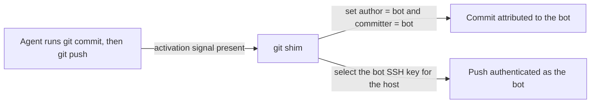

---

### User Story 2 - The Operator's Own Git Usage Is Unaffected (Priority: P2)

The operator works in the same shell and machine, committing and pushing from their normal terminal. Because the agent activation signal is absent, the shim stays inert, and the operator's own configured identity and credentials apply exactly as before the shim existed.

**Why this priority**: The scheme exists to separate human from agent commits. Silently stamping the operator's own work as the bot would corrupt the audit trail and is the worst failure mode, so this guardrail is essential though it is not a standalone product.

**Independent Test**: Without the agent activation signal, run `git commit` and `git push` through the shim and confirm the operator's identity and credentials are used, with no bot attribution and no change to `~/.gitconfig` or `~/.ssh/config`.

**Acceptance Scenarios**:

1. **Given** no agent activation signal, **When** the operator commits, **Then** the commit records the operator's own identity.
2. **Given** the shim has run many times, **When** the operator inspects `~/.gitconfig` and `~/.ssh/config`, **Then** neither file has been modified.

**Flow this story realizes: why does the operator's own commit stay under the operator identity?**

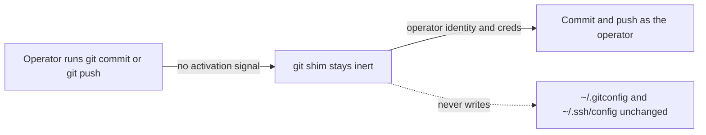

---

### User Story 3 - Agent Authenticates as the Bot over HTTPS (Priority: P2)

An agent operates in an environment whose remotes use HTTPS, or where SSH egress is blocked. The agent pushes to an HTTPS remote for the configured host, and the shim supplies the bot's credential so the push authenticates as the bot without the secret ever appearing in a URL, an argument, stored configuration, or a log.

**Why this priority**: Many environments standardize on HTTPS or block SSH, so SSH-only support would leave those agents falling back to the operator's credentials. HTTPS coverage closes that gap and removes a real leak path.

**Independent Test**: In a repository whose remote for the configured host is HTTPS, run the agent's `git push` through the shim and confirm the bot credential authenticates the push and that no secret value appears in output, logs, stored config, or the remote URL.

**Acceptance Scenarios**:

1. **Given** an HTTPS remote for the configured host, **When** the agent pushes, **Then** git authenticates with the bot credential scoped to that host.
2. **Given** an operation that emits diagnostics or errors, **When** the shim runs, **Then** no secret value appears in any output, log, stored configuration, or URL.

**Flow this story realizes: how does the agent push over HTTPS without leaking the secret?**

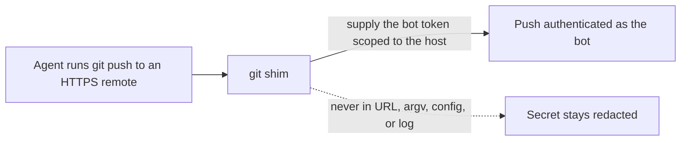

---

### User Story 4 - Unconfigured Repository Fails Safe (Priority: P2)

The agent operates in a repository for which no bot identity resolves. A write operation (commit or push) stops with a clear, actionable message telling the operator how to configure an identity or how to opt into using the human identity deliberately. Read operations continue to work without interruption.

**Why this priority**: Fail-safe behavior converts a silent misattribution into an early, legible signal. Blocking only writes, never reads, keeps the failure mode both safe and non-disruptive.

**Independent Test**: In a repository with no resolvable bot identity and the agent signal present, run a read operation and a write operation. The read succeeds, and the write stops with an actionable message.

**Acceptance Scenarios**:

1. **Given** the agent signal present and no resolvable identity, **When** the agent runs `git commit` or `git push`, **Then** the operation is refused with a message naming the remedy.
2. **Given** the same state, **When** the agent runs `git status`, `git log`, or `git fetch`, **Then** the operation proceeds normally.
3. **Given** the operator sets the explicit human-identity override, **When** the agent commits in an unconfigured repository, **Then** the commit proceeds under the operator's identity.

**Flow this story realizes: what happens when no bot identity resolves?**

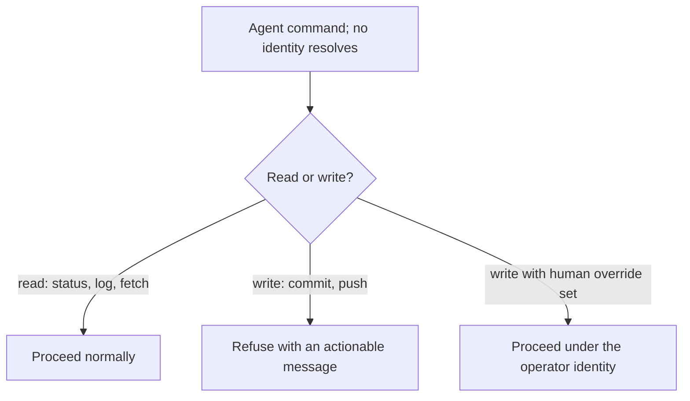

---

### User Story 5 - Inspect and Override the Resolved Identity (Priority: P3)

Before trusting the setup, the operator asks the shim to show exactly how a hypothetical commit and push would resolve: the author, the committer, the transport and credential source, the working directory, and the host, with secrets redacted and nothing executed. The operator can also force the identity on or off for a run.

**Why this priority**: Inspection and manual control build trust and speed debugging, but they are supporting capabilities rather than the primary flow.

**Independent Test**: Invoke the explain capability in a configured repository and confirm it reports the fully resolved plan with secrets redacted and performs no git action. Then set the force-agent and force-human overrides and confirm each takes effect.

**Acceptance Scenarios**:

1. **Given** a configured repository, **When** the operator requests an explanation, **Then** the shim prints the resolved author, committer, transport, credential source, working directory, and host, with secret values redacted, and executes nothing.
2. **Given** the identity mode is set to force-agent, **When** any git run occurs, **Then** the bot identity applies regardless of detection.
3. **Given** the identity mode is set to force-human, **When** any git run occurs, **Then** the operator's identity applies and the shim adds no bot identity.

**Flow this story realizes: how does the operator preview or force the resolved identity?**

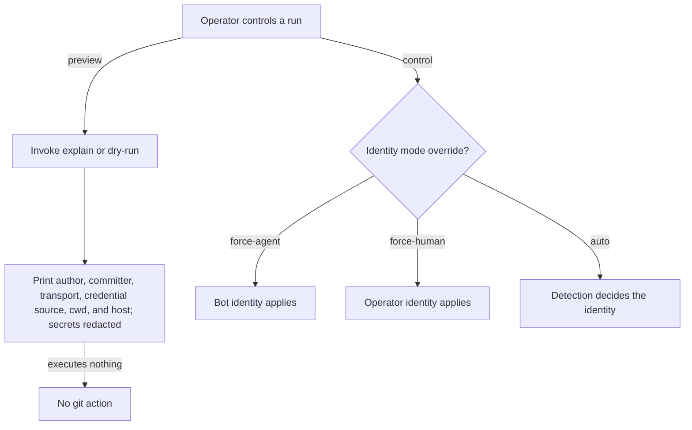

---

### User Story 6 - Bot Identity Survives Nested and Recursive Invocations (Priority: P2)

The agent runs commands that cause git to call git again: hooks that shell out to git, user-defined aliases that expand to git subcommands, submodule operations, and `rebase --exec` steps. The shim locates and delegates to the real git executable, marks the child environment so a git-internal re-entry is recognized as a continuation rather than a fresh caller, and never invokes itself in a loop even when it sits first on `PATH` under the name `git`.

**Why this priority**: Without reliable real-git resolution and loop protection, the shim breaks ordinary workflows or recurses without end. Correct re-entry handling keeps one consistent identity decision across every layer of a composite operation.

**Independent Test**: Place the shim first on `PATH` as `git`, then run an operation that triggers a hook calling git, an alias expanding to git, a submodule update, and a `rebase --exec "git ..."` step. Each completes once, delegates to the real git, and applies a single identity decision.

**Acceptance Scenarios**:

1. **Given** the shim installed as `git` at the front of `PATH`, **When** any git command runs, **Then** the shim delegates to the real git executable and does not invoke itself.
2. **Given** a pre-commit hook that runs a git command, **When** the agent commits, **Then** the inner git command is recognized as a continuation and does not re-resolve or override the identity already decided.
3. **Given** a `rebase --exec` step that runs git, **When** the rebase proceeds, **Then** the git run by that step observes the same identity decision as the enclosing rebase.

**Flow this story realizes: how does a git-calls-git re-entry stay loop-free and consistent?**

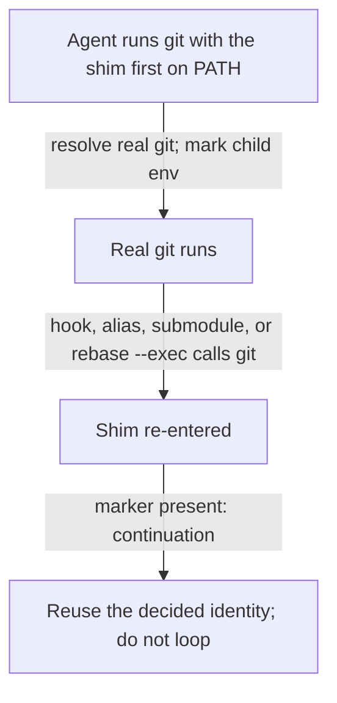

---

### User Story 7 - Caller-Set Identity Is Handled Predictably (Priority: P2)

A caller (the agent, a wrapper, or git itself during a sequence) sets `GIT_AUTHOR_*` or `GIT_COMMITTER_*` in the environment. For an originating operation the shim overwrites those with the bot; for a carrying operation the shim removes the caller's `GIT_AUTHOR_*` so git restores the original author, and in every case the shim forces the committer to the bot. The shim marks its own child environment so it can distinguish a git-internal continuation from an ordinary caller.

**Why this priority**: Environment-provided identity is the mechanism git uses internally and the one an agent is most likely to set by hand, so a predictable rule prevents both misattribution and the accidental preservation of a stale identity. The marker is a correctness mechanism rather than a security boundary, because a caller that can set the identity variables can also set the marker.

**Independent Test**: With `GIT_AUTHOR_NAME` and `GIT_AUTHOR_EMAIL` set in the environment, run an originating commit and a carrying cherry-pick. The originating commit records the bot as author, while the carrying operation preserves the original author and records the bot as committer.

**Acceptance Scenarios**:

1. **Given** caller-set `GIT_AUTHOR_*` and `GIT_COMMITTER_*`, **When** the agent runs an originating commit, **Then** both author and committer are the bot regardless of the caller values.
2. **Given** caller-set `GIT_AUTHOR_*`, **When** the agent runs a carrying operation, **Then** the shim removes those variables so git restores the original author, and it sets the committer to the bot.
3. **Given** a git-internal continuation carrying the shim's marker, **When** it runs, **Then** the shim treats it as a continuation rather than re-applying an originating decision.

**Flow this story realizes: how does the shim reconcile caller-set identity env per operation class?**

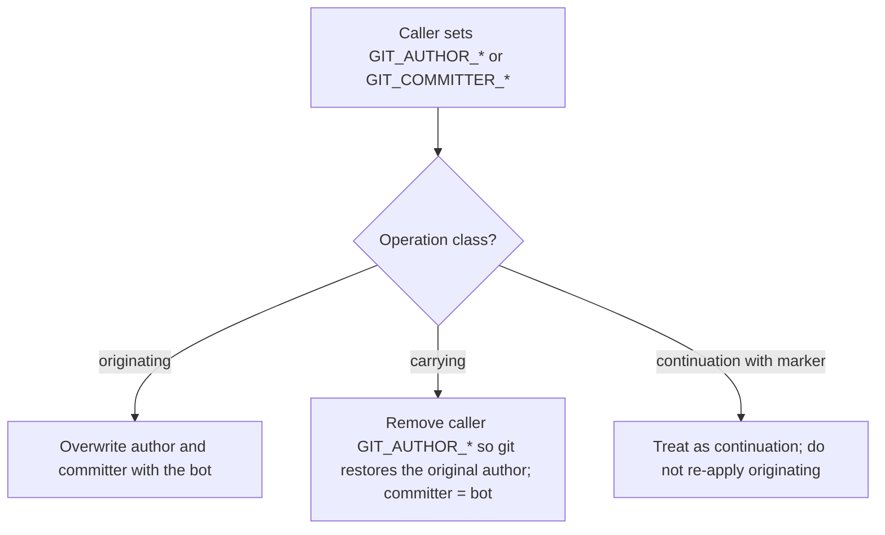

---

### User Story 8 - Untrusted Configuration Cannot Redirect Identity or Credentials (Priority: P2)

A cloned repository or a caller-controlled environment carries configuration that could redirect transport or credential selection: `insteadOf` URL rewrites, `core.sshCommand`, `credential.helper`, `core.askPass`, `core.hooksPath`, or a redirected `GIT_CONFIG_GLOBAL` and `GIT_CONFIG_SYSTEM`. The shim keeps the bot credentials scoped to the matched host and does not let untrusted configuration point a bot credential at a different host or helper. Repository-local configuration that selects identity or credentials is honored only after the operator trusts its exact bytes.

**Why this priority**: The direnv and mise history shows that honoring repository-local configuration by default hands a cloned repository control over the agent's secrets. Scoping credentials to the matched host and gating repository-local configuration behind a content-hash trust step closes that exfiltration path.

**Independent Test**: In a cloned repository that sets `insteadOf` and `credential.helper` in `.git/config` and points `GIT_CONFIG_GLOBAL` at an attacker-controlled file, run a bot-mode push. The bot credential is offered only to the matched host through the shim's own selection, and the untrusted configuration does not redirect it.

**Acceptance Scenarios**:

1. **Given** repository-local `insteadOf` rewrites toward a different host, **When** a bot-mode remote operation runs, **Then** the bot credential is not offered to the rewritten host.
2. **Given** repository-local `credential.helper` or `core.askPass`, **When** a bot-mode push runs, **Then** the shim's host-scoped credential selection governs and the untrusted helper does not receive the bot secret.
3. **Given** a repository-local configuration that selects an identity, **When** its bytes have not been trusted, **Then** the shim ignores it, and editing the file after a trust grant revokes that grant.

**Flow this story realizes: how is untrusted config kept from redirecting identity or credentials?**

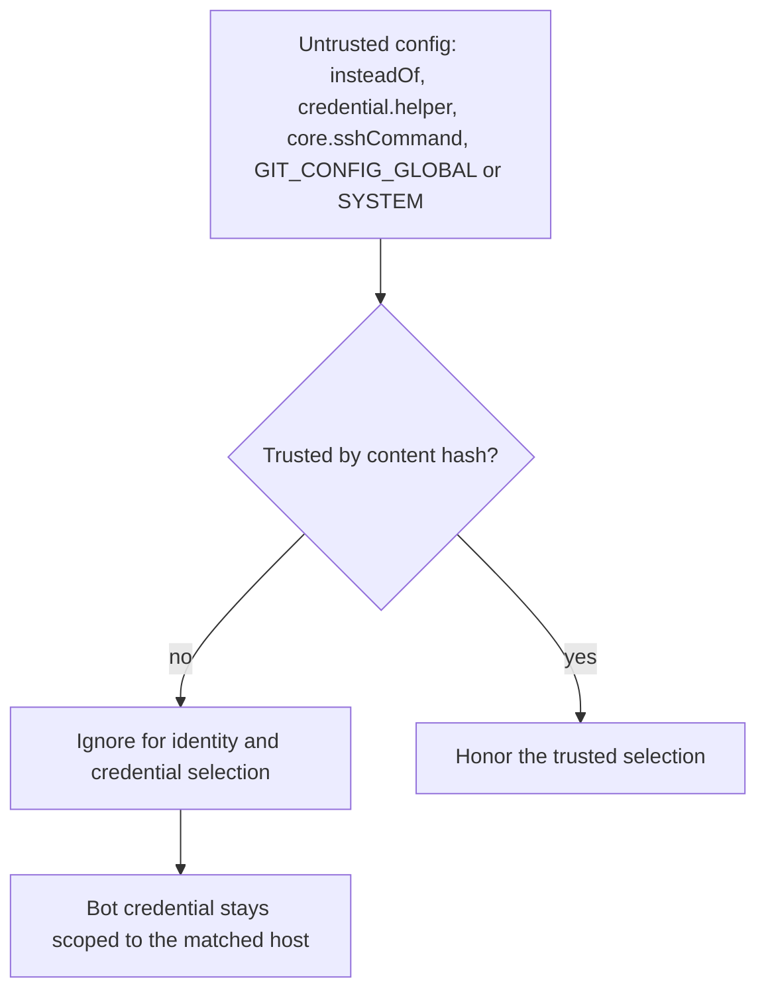

---

### User Story 9 - Writes Fail Closed on a Missing Credential or Non-Matched Host (Priority: P2)

The agent runs in bot mode with a resolved identity, but the bot's SSH key file or HTTPS token is absent, or the write targets a host the resolved identity does not match. Rather than fall back to the operator's credentials, the shim refuses the write and states the remedy.

**Why this priority**: A silent fallback to operator credentials would defeat the separation the feature exists to provide and could push agent work under the human's key. Failing closed keeps the boundary intact and names exactly what the operator must fix.

**Independent Test**: With a resolved bot identity whose key file is missing, run a push; then run a push to a host the identity does not match. Both refuse with a message, and neither uses the operator's credentials.

**Acceptance Scenarios**:

1. **Given** a resolved bot identity whose credential is absent, **When** the agent pushes, **Then** the operation is refused and no operator credential is used.
2. **Given** a write to a host the resolved identity does not match, **When** the agent pushes, **Then** the operation is refused with a message naming the host and the remedy.

**Flow this story realizes: when does a bot-mode write refuse rather than fall back?**

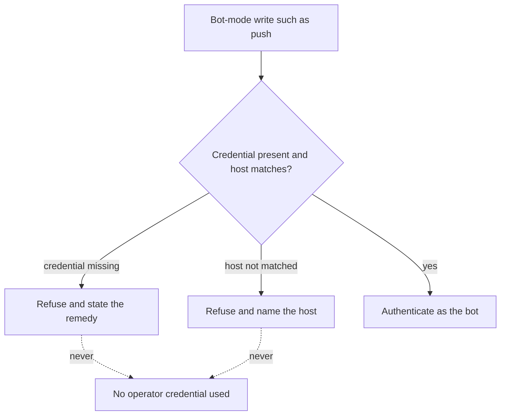

---

### User Story 10 - Ambiguous Identity Match Is Refused (Priority: P3)

Two or more configured bot identities match a repository with equal specificity. Rather than pick one silently, the shim refuses and names all matching candidates so the operator can disambiguate.

**Why this priority**: A silent tie-break would attach an arbitrary identity to real commits. Refusing and naming all matching candidates keeps attribution deliberate, though equal-specificity ties are uncommon enough to rank below the core flows.

**Independent Test**: Configure two or more identities that match the same repository with equal specificity, then run a write. The shim refuses and names every matching identity.

**Acceptance Scenarios**:

1. **Given** two or more identities matching with equal specificity, **When** the agent runs a write, **Then** the shim refuses and lists all matching candidates.
2. **Given** one identity is strictly more specific, **When** the agent runs a write, **Then** the more specific identity applies and no refusal occurs.

**Flow this story realizes: what happens when several identities match with equal specificity?**

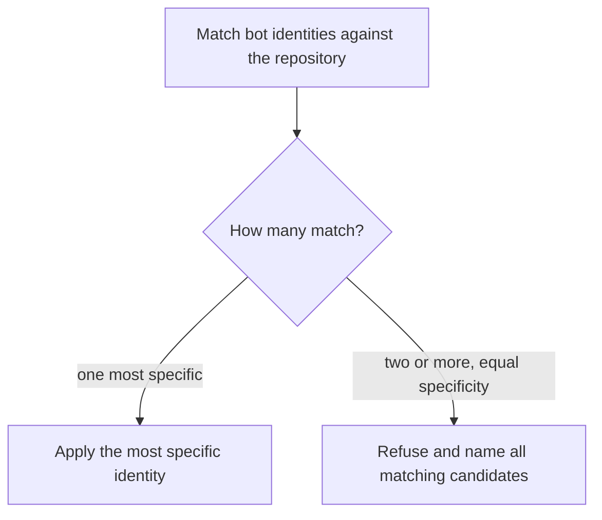

---

### User Story 11 - Annotated and Signed Tags Record the Bot as Tagger (Priority: P3)

The agent creates an annotated or signed tag. The shim records the bot as the tagger, and any signature uses the bot's signing configuration, consistent with how the shim drives committer identity for commits.

**Why this priority**: Tags are a real part of automated release flows, and a tag left under the operator's identity would break the same audit separation that commits preserve. Because tags occur less often than commits, this story ranks below the primary flow.

**Independent Test**: In a bot-mode repository, run `git tag -a` and, where signing is configured, create a signed tag. The tag object records the bot as tagger.

**Acceptance Scenarios**:

1. **Given** a bot-mode repository, **When** the agent creates an annotated tag, **Then** the tag records the bot as tagger.
2. **Given** signing is configured for the bot, **When** the agent creates a signed tag, **Then** the signature uses the bot's signing key.

**Flow this story realizes: how does a tag record the bot as tagger?**

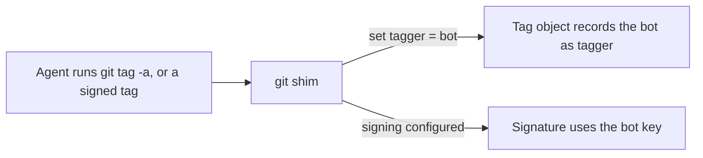

---

### User Story 12 - Stash and Notes Carry the Bot Identity (Priority: P3)

The agent creates a stash entry or adds a git note. Because each writes a commit-like object, the shim treats it as an originating write and records the bot identity, subject to the same fail-safe rules as a commit.

**Why this priority**: Stash entries and notes create objects attributed to an identity, so leaving them under the operator would leak human attribution into agent activity. These operations sit at the periphery of the commit-and-push flow, so they rank lower.

**Independent Test**: In a bot-mode repository, create a stash entry and add a note. Each records the bot identity, and each obeys the unconfigured-repository fail-safe.

**Acceptance Scenarios**:

1. **Given** a bot-mode repository, **When** the agent runs `git stash`, **Then** the stash's commit objects record the bot identity.
2. **Given** a bot-mode repository, **When** the agent adds a note, **Then** the note's commit records the bot identity.
3. **Given** no resolvable identity, **When** the agent runs `git stash`, **Then** the operation obeys the same write fail-safe as a commit.

**Flow this story realizes: how are stash entries and notes attributed?**

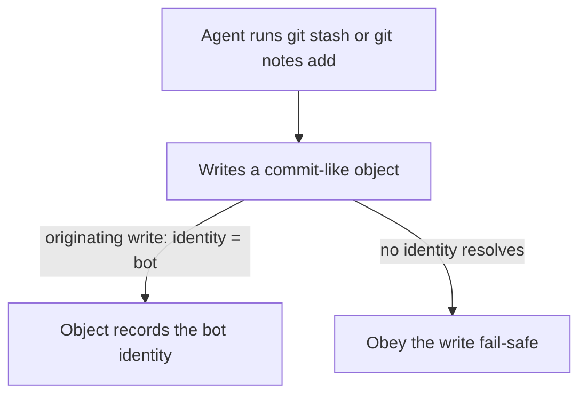

---

### Edge Cases

- **Unknown or missing activation marker under auto-detection**: When identity mode is `auto` and no recognized agent marker is present, the run is treated as the human, so no bot attribution occurs. An agent that sets no recognized marker must set the mode to `agent` explicitly, or its commits carry the operator's identity.
- **Replay and carrying of existing commits**: When the agent cherry-picks, rebases, or amends a commit, the shim records the bot as committer and preserves the original author, matching git's own author-versus-committer split. Amending or replaying the agent's own commit keeps the bot as author, while carrying a human-authored commit keeps that human as author and records the bot as committer.
- **Credentials on non-configured hosts**: The bot key and token are offered only to the matched identity's host. Operations against any other host use the operator's normal credentials and are unaffected.
- **Interrupt during a long network operation**: A termination signal such as Ctrl+C during a `push` or `clone` reaches the underlying git process so it can stop cleanly.
- **Cross-platform invocation**: On Windows the shim resolves and delegates to the real git executable and handles path and quoting differences, giving the same observable behavior as on macOS and Linux.
- **Completing a conflicted cherry-pick or rebase**: A bare `git commit` that finishes a conflicted cherry-pick or rebase is a carrying operation, so the shim preserves the original author even though the subcommand is `commit`. Detection relies on resolved sequencer state, never on the subcommand alone.
- **Untrusted repository-local configuration**: A per-repository configuration that selects identity or points at credentials is ignored until the operator trusts it through a content-hash allow step; editing the file revokes the grant. This prevents a cloned repository from redirecting the agent's identity or credential selection.

## Diagrams

### Owner Relations

**Question this diagram answers: who owns each identity, credential, and configuration, and who may write it?**

The operator owns and configures everything on the operator side, and the shim never writes the operator's own git or SSH configuration. Each bot identity is defined in the shim's configuration, references its secrets by host-scoped reference rather than storing them, and is the entity a resulting commit is attributed to.

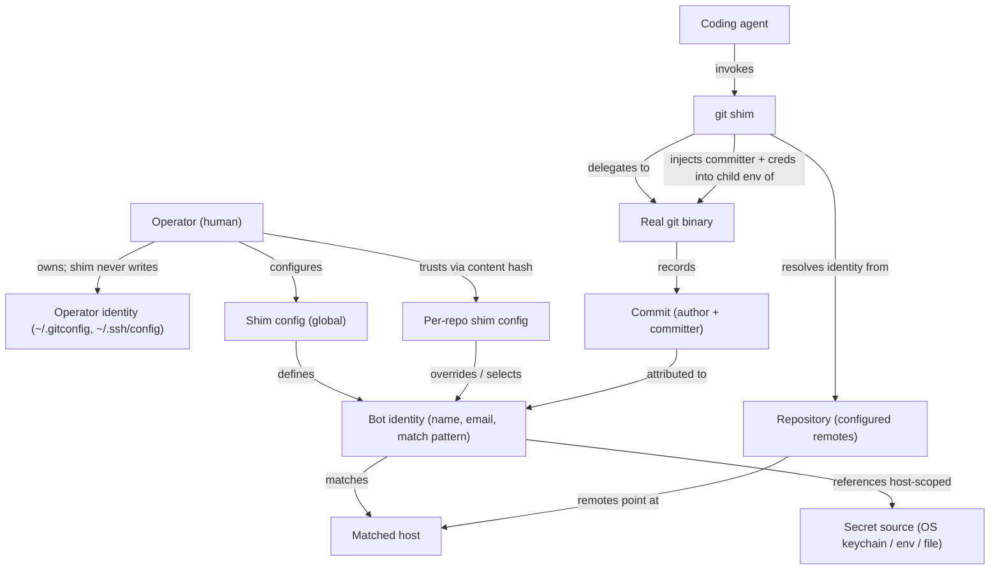

### Story Flows

**Question this diagram answers: how does one git invocation resolve to an identity, credential, and write decision, and which user story does each path realize?**

Every invocation first resolves the identity mode, then in bot mode counts how many identities match the repository, classifies the operation, and, for remote work, checks that a scoped credential exists for the matched host before delegating to the real git. Each terminal node names the user story that path realizes. Re-entry safety (US6), caller-environment precedence (US7), and repository-configuration trust (US8) are cross-cutting rules applied within the delegate and classify steps, so the diagram draws the identity-and-write decision rather than a node for each story.

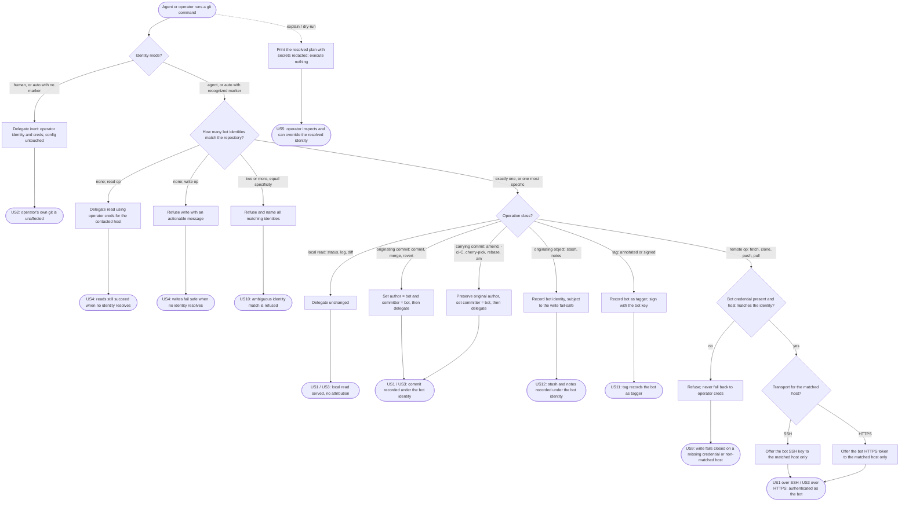

## Requirements *(mandatory)*

### Functional Requirements

**Delegation and fidelity**

- **FR-001**: The shim MUST delegate every git invocation to the underlying git program and propagate its exit code, standard input, standard output, and standard error unchanged.
- **FR-002**: The shim MUST forward terminating signals to the underlying git process.
- **FR-003**: The shim MUST pass through unchanged any flags, arguments, and environment it does not explicitly manage.
- **FR-004**: The shim MUST NOT modify the operator's `~/.gitconfig`, `~/.ssh/config`, or ambient shell environment.

**Identity**

- **FR-005**: When acting under the bot identity, the shim MUST set the committer to the configured bot for commits it delegates.
- **FR-006**: When acting under the bot identity, the shim MUST set the author to the bot for commits that originate a new change (a fresh `commit`, a `merge` commit, or a `revert`), and MUST preserve the existing author for commits that carry or amend an existing commit (`commit --amend`, a commit that reuses another commit's authorship via `-c` or `-C`, `cherry-pick`, `rebase`, `am`, and any commit completed while a cherry-pick or rebase is in progress). When preserving an author, the shim MUST NOT substitute an author of its own, so that git retains the commit's original author.
- **FR-031**: The shim MUST classify each commit-creating invocation as originating or carrying using, in precedence order: an explicit author argument (respected, never overridden); an explicit reset-author request (originating, author becomes the bot); a message-reuse option (`-c` or `-C`) that reuses another commit's authorship (carrying); the `--amend` option (carrying); in-progress cherry-pick or rebase state (carrying); an in-progress merge or a `revert` (originating); and otherwise a fresh commit (originating).
- **FR-032**: The shim MUST detect in-progress sequencer state by resolving each state name through the underlying git (for example `git rev-parse --git-path`), never by reading literal `.git/` paths, so that detection stays correct in linked worktrees and submodules and honors `GIT_DIR` and a changed working directory. This bounded read of a fixed, closed set of repository state names is the one permitted exception to the shim's otherwise parse-free delegation.
- **FR-007**: The shim MUST resolve whether to act as the bot from an identity mode with three states: `auto` (detect), `agent` (force bot), and `human` (force operator, no bot identity).
- **FR-008**: Under `auto`, the shim MUST treat the run as the bot only when a recognized agent marker is present, and otherwise MUST treat the run as the operator.
- **FR-009**: The shim MUST support operator-extensible recognition of vendor agent markers and MUST allow the operator to enable or disable vendor auto-detection.
- **FR-010**: An explicit identity mode set by the caller MUST take precedence over vendor auto-detection.

**Fail-safe policy**

- **FR-011**: When the run resolves to the bot but no bot identity is configured for the repository, the shim MUST refuse write operations (operations that create a commit or contact a remote to write) with a message that names the remedy.
- **FR-012**: The shim MUST allow read-only operations to proceed even when no bot identity resolves.
- **FR-013**: The shim MUST provide an explicit override that lets a write proceed under the operator's identity when the operator opts in.

**Transport and credentials**

- **FR-014**: The shim MUST support authenticating as the bot over both SSH and HTTPS remotes.
- **FR-015**: The shim MUST let the underlying git select the transport; the shim MUST NOT force a transport choice.
- **FR-016**: The shim MUST scope a bot's SSH key so it is offered only to that identity's matched host, leaving the operator's credentials in effect for all other hosts.
- **FR-017**: The shim MUST scope a bot's HTTPS credential so it is supplied only for that identity's matched host, leaving the operator's credentials in effect for all other hosts.

**Secret handling**

- **FR-018**: The shim MUST NOT place a secret value in a command-line argument, a remote URL, stored git configuration, or any log.
- **FR-019**: The shim MUST source the HTTPS token from an operator-specified location (an environment variable, a file, or a command) rather than an inlined literal.
- **FR-020**: Inspection and diagnostic output MUST redact secret values and MAY show non-secret references such as key paths.

**Inspection and configuration**

- **FR-021**: The shim MUST provide a way to display the fully resolved invocation (author, committer, transport, credential source, working directory, and host) without executing any git action.
- **FR-022**: The shim MUST expose its controls through descriptive, unambiguous environment-variable and configuration names rather than terse flags.
- **FR-023**: The shim MUST read its identity and credential configuration from operator-provided configuration and MUST NOT require the agent to set anything per command.

**Platform parity**

- **FR-024**: The shim MUST provide equivalent observable behavior on Windows, macOS, and Linux, or MUST fail with a clear, actionable error where a platform is unsupported.

**Identity resolution and matching**

- **FR-025**: The shim MUST support multiple bot identities and MUST select among them at the repository level. For local operations that name no remote (for example `git commit`), the shim MUST match against the primary remote (the upstream tracked remote of the current branch, or `origin`, or the single configured remote) and MAY consider the repository path. If multiple configured remotes resolve to conflicting bot identities without a primary remote, the shim MUST fail closed and refuse the write with an actionable message.
- **FR-026**: The shim MUST treat equivalent SSH and HTTPS remote forms — for example `git@host:org/repo` and `https://host/org/repo.git`, with or without a trailing `.git` — as the same canonical `host/org/repo` for matching. This canonicalization is a shim behavior and a deliberate divergence from native git, which matches remote URL strings literally.
- **FR-027**: The shim MUST support per-repository configuration that overrides and extends the global configuration.
- **FR-028**: When matching patterns for a remote, the shim MUST resolve deterministically: per-repository configuration takes precedence over global, and among patterns the most specific match wins. If two or more patterns tie in specificity, or if multiple remotes resolve to conflicting identities, the shim MUST fail closed and refuse write operations.
- **FR-029**: Each identity MUST carry its own host-scoped credentials (an SSH key and/or an HTTPS token source), and the shim MUST offer those credentials only for that identity's matched host.
- **FR-030**: Repository-local configuration that influences identity or credential selection MUST NOT be honored until the operator trusts it via a content-hash allow step, and the shim MUST NOT read secret values from repository-local files.

### Key Entities

- **Bot Identity**: An automated committer. Attributes: display name, email, a match pattern over host/organization/repository (with wildcard and template support), and host-scoped credential references (an SSH key and/or an HTTPS token source). Never stores the secret values themselves.
- **Activation Signal**: The input that tells the shim whether a run acts as the bot or the operator. Composed of the identity mode and the set of recognized agent markers.
- **Shim Configuration**: Operator-provided settings in two layers, global and per-repository, where per-repository overrides global and must be trusted before use. Covers the ordered set of bot identities and their repository match patterns (over the union of configured remotes and optionally the repository path), the unresolved-identity policy, vendor marker recognition, and the trust (content-hash allow) state for repository-local configuration.
- **Resolved Invocation Plan**: The computed decision for a given run, covering identity, transport, credential source, working directory, and host, used both to act and to explain.

## Success Criteria *(mandatory)*

### Measurable Outcomes

- **SC-001**: In a configured repository with the agent active, 100% of commits that originate a new change through the shim record the bot as author and committer, and 0% record the operator.
- **SC-002**: With the agent inactive, 0% of the operator's commits are re-attributed to the bot, and the operator's `~/.gitconfig` and `~/.ssh/config` remain byte-for-byte unchanged after repeated shim use.
- **SC-003**: Across an audit of command output, error messages, logs, stored configuration, and remote URLs, secret values appear 0 times.
- **SC-004**: An agent achieves correct bot attribution while issuing only standard git commands with no added flags and no per-command setup; operator setup is performed one time.
- **SC-005**: When no bot identity resolves for a repository, 100% of write operations are blocked with an actionable message while 100% of read operations continue to succeed.
- **SC-006**: The bot's key and token are presented only to the configured host, with 0 presentations of bot credentials to any other host.
- **SC-007**: The operator can obtain a complete, secret-redacted preview of how a commit and push will resolve without any git action being performed.
- **SC-008**: Correct behavior for stories 1 through 4 is reproducible on Windows, macOS, and Linux.
- **SC-009**: Given several configured identities, the shim selects the correct identity for a repository in 100% of cases according to per-repository-over-global precedence and most-specific-match, whether the remote is expressed in SSH or HTTPS form.
- **SC-010**: Repository-local configuration that selects identity or credentials is honored only after an explicit content-hash trust step; in 0% of cases does an untrusted repository-local file change the resolved identity or credential.
- **SC-011**: When the agent carries an existing commit (cherry-pick, rebase, or an amend of a human-authored commit), 100% of the resulting commits preserve the original author and record the bot as committer.

## Assumptions

- Multiple bot identities are supported, selected at the repository level by matching operator-defined host/organization/repository patterns against the primary remote (tracked upstream or origin), with per-repository configuration layered over global. Conflicting multi-remote resolutions without a primary remote fail closed. SSH/HTTPS normalization and most-specific precedence are shim behaviors, not native git behavior.
- Agents author the changes they originate, and the shim records the bot as author for those. When the agent carries an existing commit, the shim preserves the original author and records the bot only as committer, matching git's author-versus-committer split.
- Commit and tag signing (GPG or SSH signing) is out of scope for this version.
- The operator installs the shim ahead of the real git in the agent's execution environment and creates the bot account, key, and token out of band, following the referenced agent-identity approach.
- The operator provides the bot identity and credential references through configuration before relying on bot attribution.
- Supported platforms are Windows, macOS, and Linux, consistent with the project's cross-platform parity principle.
