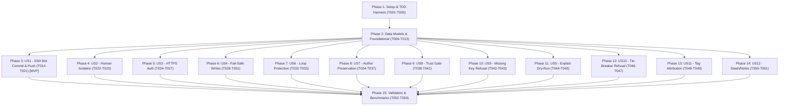

---

description: "100% Test-Driven Design (TDD) task list for Git Author Identity Shim implementation"
---

# Tasks: Git Author Identity Shim (100% TDD)

**Input**: Design documents from `/specs/001-git-author-shim/`
**Prerequisites**: `plan.md`, `spec.md`, `research.md`, `data-model.md`, `contracts/`, `quickstart.md`, `.specify/memory/constitution.md`

**Governing Discipline**: **100% Test-Driven Design (Constitution Principle V: Red-Green-Refactor)**.
* Every single implementation task is preceded by an explicit, failing test task (`RED`).
* Test tasks define concrete, observable assertions (exact exit codes, byte-for-byte hashes, redacted substrings, and process vectors).
* No implementation task may start until its gating test task has been written and observed to FAIL.

## Format: `- [ ] [ID] [P?] [Story?] Description with file path`

- **[P]**: Can run in parallel (different files, no dependencies on incomplete tasks)
- **[Story]**: Which user story this task belongs to (e.g. `[US1]`, `[US2]`)
- Include exact file paths and observable assertions in descriptions

---

## Phase 1: Setup & TDD Test Harness (Shared Infrastructure)

**Purpose**: Project initialization, packaging, isolated test harness fixtures, and CI/CD matrix.

- [x] T001 Initialize Python project package structure in `pyproject.toml` with `hatchling` build backend and entry points for `git` and `git-shim`
- [x] T002 [P] Create initial package skeleton with `src/uv_shims/__init__.py` and `src/uv_shims/git/__init__.py`
- [x] T003 [P] Configure development tooling, linting, and formatting (ruff, pytest, pytest-xdist) in `pyproject.toml`
- [x] T004 [P] Implement TDD test harness in `tests/conftest.py`: function-scoped isolated `HOME` / `USERPROFILE` / `XDG_CONFIG_HOME`, environment sanitizer (wiping ambient `GIT_*`, `CLAUDE_*`, `AGENT_ID`, `SSH_AUTH_SOCK`), fake Git recording wrapper, and temporary repository factories
- [x] T005 [P] Create GitHub Actions CI matrix workflow for Windows, macOS, and Linux across Python 3.12+ in `.github/workflows/ci.yml`

---

## Phase 2: Foundational Data Models & Core Utilities (TDD)

**Purpose**: Core data structures, configuration loader, real Git discovery, and agent detection.

### Data Models & Secret Redaction (TDD Cycle 1)
- [x] T006 [P] Write unit tests for `data_models.py` in `tests/unit/test_data_models.py`: assert `BotIdentity`, `SSHCredential`, and `HTTPSCredential` structure, and verify `InvocationPlan.__repr__` and string rendering strictly redact secret tokens
- [x] T007 Implement core data structures and redaction formatting in `src/uv_shims/git/data_models.py` (gates on T006 passing)

### Configuration Loader (TDD Cycle 2)
- [x] T008 [P] Write unit tests for TOML configuration parsing and validation in `tests/unit/test_config.py`: assert loading valid profiles, multi-identity arrays, default mode fallback, and rejection of malformed schemas
- [x] T009 Implement TOML configuration loader and validator in `src/uv_shims/git/config.py` (gates on T008 passing)

### Real Git Discovery & Loop Sentinel (TDD Cycle 3)
- [x] T010 [P] Write unit tests for real Git discovery in `tests/unit/test_real_git_discovery.py`: assert scanning `PATH` (and Windows `PATHEXT`), skipping the shim executable itself, handling custom `GIT_SHIM_REAL_PATH`, and injecting `__GIT_SHIM_CONTINUATION=1`
- [x] T011 Implement real Git binary resolution and recursion sentinel handling in `src/uv_shims/git/real_git_discovery.py` (gates on T010 passing)

### Agent Mode & Marker Detection (TDD Cycle 4)
- [x] T012 [P] Write unit tests for agent detection in `tests/unit/test_agent_detection.py`: assert detection of `AGENT_ID`, `CLAUDE_CODE`, `CODEX_SANDBOX`, custom markers, and mode overrides (`GIT_SHIM_MODE=auto|agent|human`)
- [x] T013 Implement agent mode and vendor marker detection in `src/uv_shims/git/agent_detection.py` (gates on T012 passing)

**Checkpoint**: Foundation complete and 100% verified by failing-then-passing unit tests.

---

## Phase 3: User Story 1 - Agent Commits and Pushes as the Bot over SSH (Priority: P1) 🎯 MVP

**Goal**: When the agent signal is active in an SSH repository, `git commit` stamps the bot identity as author and committer, and `git push` authenticates using the bot's dedicated SSH key.

### URL Matcher & Specificity (TDD Cycle 5)
- [x] T014 [P] [US1] Write unit tests for remote URL canonicalization in `tests/unit/test_repo_identity_matcher.py`: assert normalization of SSH (`git@github.com:org/repo.git`, `ssh://git@github.com:22/org/repo.git`), HTTPS (`https://github.com/org/repo.git`), port preservation, and wildcard pattern matching
- [x] T015 [US1] Implement canonical URL normalization and wildcard matcher in `src/uv_shims/git/repo_identity_matcher.py` (gates on T014 passing)

### SSH Command Generator (TDD Cycle 6)
- [x] T016 [P] [US1] Write unit tests for SSH command generation in `tests/unit/test_credential_injector.py`: assert `-i <key> -o IdentitiesOnly=yes -F /dev/null` (and `-F NUL` on Windows), forward-slash path conversion (`C:/key`), and shell escaping
- [x] T017 [US1] Implement SSH command generator with forward-slash formatting and host validation in `src/uv_shims/git/credential_injector.py` (gates on T016 passing)

### Process Execution & Passthrough Fidelity (TDD Cycle 7)
- [x] T018 [P] [US1] Write contract tests for process execution in `tests/contract/test_process_execution.py`: assert exact exit code propagation (e.g. child exit 37 returns 37 on Windows/POSIX), stdio stream separation, unmanaged argv/env passthrough, and terminating signal forwarding (`SIGINT`/`SIGTERM` on POSIX, `Ctrl+C`/`Ctrl+Break` on Windows)
- [x] T019 [US1] Implement CLI execution engine in `src/uv_shims/git/cli.py` and `src/uv_shims/git/__main__.py` with lazy imports, Windows `subprocess.run` exit code propagation, signal handlers, and stdio forwarding (gates on T018 passing)

### End-to-End Integration (TDD Cycle 8)
- [x] T020 [P] [US1] Write integration test in `tests/integration/test_ssh_injection.py`: create a test repository, run `git commit` as agent, and assert commit author and committer equal the configured bot identity, and `git push` invokes SSH with the isolated bot key
- [x] T021 [US1] Wire end-to-end SSH bot commit and push execution in `src/uv_shims/git/cli.py` (gates on T020 passing)

**Checkpoint**: MVP is functional and proven by automated unit, contract, and integration tests.

---

## Phase 4: User Story 2 - The Operator's Own Git Usage Is Unaffected (Priority: P2)

**Goal**: When the agent activation signal is absent, the shim acts as a zero-overhead passthrough; `~/.gitconfig` and `~/.ssh/config` are never modified.

### Human Passthrough & Zero-Mutation (TDD Cycle 9)
- [x] T022 [P] [US2] Write integration test in `tests/integration/test_passthrough.py`: run `git commit` and `git push` with no agent marker, assert operator identity is preserved, and assert SHA-256 hashes of `~/.gitconfig` and `~/.ssh/config` are byte-for-byte identical before and after
- [x] T023 [US2] Implement human-mode fast short-circuit in `src/uv_shims/git/cli.py` (gates on T022 passing)

**Checkpoint**: Human isolation guaranteed and verified with cryptographic hash assertions.

---

## Phase 5: User Story 3 - Agent Authenticates as the Bot over HTTPS (Priority: P2)

**Goal**: When pushing to an HTTPS remote, the shim supplies the bot's scoped token via an in-memory credential helper without exposing secrets in `argv`, logs, or remote URLs.

### HTTPS Credential Injection & Sourcing (TDD Cycle 10)
- [x] T024 [P] [US3] Write unit tests in `tests/unit/test_https_credentials.py`: assert host-scoped helper flags (`-c credential.https://<host>.helper=`), token resolution from environment variables (`token_env_var`), files (`token_file`), and external commands (`token_command`), and assert zero token characters in argv/logs
- [x] T025 [US3] Implement dynamic HTTPS credential helper generation with multi-source token resolution in `src/uv_shims/git/credential_injector.py` (gates on T024 passing)

### HTTPS Push Integration (TDD Cycle 11)
- [x] T026 [P] [US3] Write integration test in `tests/integration/test_https_injection.py`: simulate HTTPS push with a recording fake helper, assert bot token is provided for matched host, untrusted `.git/config` helpers are neutralized, and foreign hosts remain untouched
- [x] T027 [US3] Wire HTTPS credential helper injection into `src/uv_shims/git/cli.py` (gates on T026 passing)

**Checkpoint**: Secure HTTPS transport verified with zero secret leakage.

---

## Phase 6: User Story 4 - Unconfigured Repository Fails Safe (Priority: P2)

**Goal**: When the agent runs in a repository with no matching bot identity, write operations (`commit`, `push`) are refused with an actionable message, while read operations (`status`, `log`, `fetch`) continue normally.

### Read/Write Command Classification (TDD Cycle 12)
- [x] T028 [P] [US4] Write unit tests in `tests/unit/test_command_classifier.py`: assert classification of read operations (`status`, `log`, `diff`, `fetch`) vs write operations (`commit`, `push`, `tag`, `stash`, `notes`)
- [x] T029 [US4] Implement command taxonomy classifier in `src/uv_shims/git/commit_authorship_classifier.py` (gates on T028 passing)

### Fail-Closed Write Policy (TDD Cycle 13)
- [x] T030 [P] [US4] Write integration test in `tests/integration/test_fail_safe.py`: in an unconfigured repository under agent mode, assert `git status` and `git log` exit 0, while `git commit` and `git push` abort with exit 1 and output the exact configuration remedy; assert `GIT_SHIM_MODE=human` allows writes under operator identity
- [x] T031 [US4] Implement fail-closed write refusal and human override in `src/uv_shims/git/cli.py` (gates on T030 passing)

**Checkpoint**: Fail-safe write boundaries verified.

---

## Phase 7: User Story 6 - Bot Identity Survives Nested and Recursive Invocations (Priority: P2)

**Goal**: Nested Git invocations (pre-commit hooks, aliases, submodule updates, `rebase --exec`) detect continuation sentinels and delegate to real Git without self-recursion loops while preserving security boundaries.

### Recursion & Continuation Safety (TDD Cycle 14)
- [x] T032 [P] [US6] Write integration tests in `tests/integration/test_recursion_protection.py`: install shim at front of `PATH`, execute a pre-commit hook that calls `git diff`, a submodule update (`git submodule update`), an alias expanding to `git`, and a `rebase --exec "git status"`; assert single execution with zero recursion loops, and assert a nested write to an unconfigured host still triggers fail-closed refusal
- [x] T033 [US6] Enforce `__GIT_SHIM_CONTINUATION` propagation and child invocation security in `src/uv_shims/git/real_git_discovery.py` and `src/uv_shims/git/cli.py` (gates on T032 passing)

**Checkpoint**: Loop-free, secure execution across nested Git operations.

---

## Phase 8: User Story 7 - Caller-Set Identity Is Handled Predictably (Priority: P2)

**Goal**: For originating commits (fresh commit, merge, revert), caller-set `GIT_AUTHOR_*` is overwritten with the bot identity; for carrying operations (`cherry-pick`, `rebase`, `--amend`, `-c`/`-C`, `am`), the original author is preserved and bot is stamped as committer.

### Batched Sequencer State Detection (TDD Cycle 15)
- [x] T034 [P] [US7] Write unit tests in `tests/unit/test_sequencer_detection.py`: assert batched probing of `CHERRY_PICK_HEAD`, `REBASE_HEAD`, `rebase-merge`, `rebase-apply`, `MERGE_HEAD`, assert `os.path.exists()` filtering on returned paths, and assert graceful handling of bare repositories
- [x] T035 [US7] Implement batched sequencer state inspection in `src/uv_shims/git/commit_authorship_classifier.py` (gates on T034 passing)

### Author Preservation vs Overwrite (TDD Cycle 16)
- [x] T036 [P] [US7] Write integration tests in `tests/integration/test_cherry_pick_rebase.py`:
  * Cherry-pick a human commit: assert Author is preserved and Committer is Bot.
  * Rebase with conflict resolved by bare `git commit`: assert Author is preserved and Committer is Bot.
  * Fresh commit with caller-set `GIT_AUTHOR_*`: assert Author and Committer are both overwritten to Bot.
  * Carrying commit with caller-set `GIT_AUTHOR_*`: assert caller env is removed so Git restores original author.
  * `merge` and `revert` commits: assert Author and Committer are both Bot.
- [x] T037 [US7] Implement author-preservation vs author-overwrite injection logic in `src/uv_shims/git/cli.py` (gates on T036 passing)

**Checkpoint**: Historical authorship preserved on replays and bot stamped on fresh work.

---

## Phase 9: User Story 8 - Untrusted Configuration Cannot Redirect Identity or Credentials (Priority: P2)

**Goal**: Repository-local `.git-shim.toml` is ignored until the operator explicitly trusts its SHA-256 hash; tampering with the file revokes the grant; secrets are never read from repo-local files.

### Content-Hash Trust Registry (TDD Cycle 17)
- [x] T038 [P] [US8] Write unit tests in `tests/unit/test_repo_config_trust.py`: assert SHA-256 hash calculation, trust allowlisting, revocation upon content modification, and refusal to read secret tokens from local config files
- [x] T039 [US8] Implement SHA-256 content hashing and trusted registry persistence in `src/uv_shims/git/repo_config_trust.py` (gates on T038 passing)

### Trust CLI & Loader Integration (TDD Cycle 18)
- [x] T040 [P] [US8] Write contract tests in `tests/contract/test_trust_cli.py`: assert `git-shim trust <file>` records hash, `git-shim untrust <file>` removes hash, and untrusted local configs are ignored during command resolution
- [x] T041 [US8] Integrate trust verification into `src/uv_shims/git/config.py` and implement `trust`/`untrust` subcommands in `src/uv_shims/git/cli.py` (gates on T040 passing)

**Checkpoint**: Repository-local configuration gated behind cryptographic trust verification.

---

## Phase 10: User Story 9 - Writes Fail Closed on a Missing Credential or Non-Matched Host (Priority: P2)

**Goal**: If the bot's private SSH key or HTTPS token is missing, or the push targets a host outside the matched identity (including via `url.*.insteadOf` rewrites), write operations abort immediately without fallback to human credentials.

### Fail-Closed Credentials & Destination Validation (TDD Cycle 19)
- [x] T042 [P] [US9] Write integration tests in `tests/integration/test_fail_closed_credentials.py`:
  * Attempt push with missing SSH key file -> assert immediate refusal with exit code 1 and no fallback to operator key.
  * Attempt push to foreign/unmatched host -> assert immediate refusal with exit code 1.
  * Attempt push where `url.*.insteadOf` or `pushInsteadOf` rewrites remote to an untrusted host -> assert immediate refusal before any network connection occurs.
- [x] T043 [US9] Implement pre-flight credential existence checks and effective destination host validation in `src/uv_shims/git/credential_injector.py` and `src/uv_shims/git/cli.py` (gates on T042 passing)

**Checkpoint**: Fail-closed boundary guarantees zero credential leakage or silent human fallback.

---

## Phase 11: User Story 5 - Inspect and Override the Resolved Identity (Priority: P3)

**Goal**: Operator can run `git-shim explain [--json]` to preview the resolved invocation plan (with redacted secrets) without executing any Git actions, or list identities via `git-shim list-identities`.

### Dry-Run Inspection & Redaction (TDD Cycle 20)
- [x] T044 [P] [US5] Write contract tests in `tests/contract/test_explain_schema.py`: assert `git-shim explain --json` output conforms to JSON Schema, contains zero secret token characters, outputs working directory and target host, and executes zero Git subprocesses
- [x] T045 [US5] Implement `explain` (text and JSON) and `list-identities` formatting with strict secret redaction in `src/uv_shims/git/cli.py` (gates on T044 passing)

**Checkpoint**: Full dry-run observability and management CLI verified.

---

## Phase 12: User Story 10 - Ambiguous Identity Match Is Refused (Priority: P3)

**Goal**: When two bot identities match a repository with equal specificity, the shim refuses the write and lists all matching candidates.

### Specificity Scoring & Tie Refusal (TDD Cycle 21)
- [x] T046 [P] [US10] Write unit tests in `tests/unit/test_ambiguity_matcher.py`: assert pattern specificity scoring (exact host/org/repo > wildcard > host-only), assert multi-remote conflict detection, and assert refusal when two patterns tie in specificity
- [x] T047 [US10] Implement specificity scoring and tie-breaker refusal in `src/uv_shims/git/repo_identity_matcher.py` (gates on T046 passing)

**Checkpoint**: Ambiguous configurations halt safely without misattribution.

---

## Phase 13: User Story 11 - Annotated and Signed Tags Record the Bot as Tagger (Priority: P3)

**Goal**: Creating annotated or signed tags (`git tag -a`, `git tag -s`) stamps the bot identity as tagger.

### Tag Attribution (TDD Cycle 22)
- [x] T048 [P] [US11] Write integration test in `tests/integration/test_tag_attribution.py`: run `git tag -a v1.0.0 -m "Release"` under agent mode, inspect tag object, and assert tagger name and email equal the bot identity
- [x] T049 [US11] Implement tagger classification and environment injection in `src/uv_shims/git/commit_authorship_classifier.py` and `src/uv_shims/git/cli.py` (gates on T048 passing)

**Checkpoint**: Tagging workflows correctly attributed to bot.

---

## Phase 14: User Story 12 - Stash and Notes Carry the Bot Identity (Priority: P3)

**Goal**: `git stash` and `git notes` invocations create commit objects stamped with the bot identity and adhere to write fail-safes.

### Stash & Notes Attribution (TDD Cycle 23)
- [x] T050 [P] [US12] Write integration test in `tests/integration/test_stash_notes.py`: run `git stash push` and `git notes add` under agent mode, inspect created objects, and assert bot attribution
- [x] T051 [US12] Classify `stash` and `notes` as originating writes in `src/uv_shims/git/commit_authorship_classifier.py` (gates on T050 passing)

**Checkpoint**: Secondary Git object attribution verified.

---

## Phase 15: Polish & Performance Benchmarking (TDD Verification)

**Purpose**: End-to-end quickstart validation, performance check, and documentation.

- [x] T052 [P] Execute and verify all 5 end-to-end validation scenarios from `specs/001-git-author-shim/quickstart.md`
- [x] T053 [P] Write and execute benchmark in `tests/integration/test_performance.py`: assert in-process CPU resolution overhead is <5ms via `time.perf_counter()`, and measure lazy-import time via `python -X importtime`
- [x] T054 [P] Create complete user documentation, setup examples, and troubleshooting guide in `README.md`

---

## Dependencies & Execution Order (Red-Green Flow)

### Strict TDD Rules for Execution:
1. **Red Phase First**: For every cycle (e.g. T006 -> T007, T014 -> T015), write the test in the designated file, run `pytest`, and verify it **FAILS** with a meaningful assertion error.
2. **Green Phase**: Implement only the minimal code required to make the failing test **PASS**.
3. **Refactor**: Clean up and optimize while ensuring all tests continue to pass.
4. **No Code Without a Test**: No functional code may be written in `src/` without an existing, failing test.
